**Financial Document Intelligence Platform (AWS)**

* Designed and implemented an end-to-end AWS data pipeline (API Gateway → Lambda → S3 → Textract → OpenSearch → SageMaker) to automate extraction and analysis of annual and quarterly financial reports.
* Developed a document retrieval and ML inference workflow to identify Top-3 supporting evidence with confidence scores for over 30 financial metrics from approximately 3,000 extracted sentences.
* Generated structured financial reports by integrating extracted financial metrics with supporting evidence, enabling efficient review and validation by financial analysts.

---

## Project Desc

> Tell me about one project you're proud of.

你可以这样回答：

This project is a Financial Document Intelligence Platform built on AWS.

The goal was to automate the extraction and analysis of annual and quarterly financial reports. Traditionally, analysts need to manually search hundreds of pages to verify financial metrics such as revenue, operating income, and cash flow.

I designed an end-to-end AWS pipeline where users upload a PDF through API Gateway. The document is stored in S3 and processed by Amazon Textract to extract text. The extracted sentences are indexed in OpenSearch for retrieval. After candidate retrieval, a machine learning model deployed on SageMaker identifies the Top-3 supporting sentences with confidence scores for each financial metric.

Finally, the pipeline combines the extracted financial values and supporting evidence into a structured report, allowing analysts to quickly validate financial information instead of manually reading the entire report.

---

# Amazon/AWS QA

## Q1. Why did you use OpenSearch?

**回答**

Annual reports contain around 3,000 extracted sentences. Running ML inference on every sentence would be inefficient. OpenSearch narrows the search space by retrieving the most relevant candidates first, significantly reducing inference latency while maintaining high recall.

---

## Q2. Why SageMaker instead of Lambda?

**回答**

The model is relatively large and requires loading into memory. Deploying it as a SageMaker endpoint allows reusable model instances, lower inference latency, easier version management, and independent scaling from the rest of the pipeline.

---

## Q3. Why Textract instead of OCR libraries?

**回答**

Financial reports contain tables, multi-column layouts, and complex formatting. Textract provides structured document extraction with page information and works reliably for enterprise PDF documents without maintaining OCR infrastructure.

---

## Q4. Why store PDFs in S3?

**回答**

S3 serves as the data lake for raw documents. It provides durable storage, versioning, lifecycle management, and integrates naturally with Textract and other AWS services.

---

## Q5. Why API Gateway?

**回答**

API Gateway exposes a REST endpoint for document uploads and decouples external clients from the backend processing pipeline.

---

## Q6. Why Lambda?

**回答**

Each processing step is event-driven and relatively lightweight. Lambda eliminates server management and scales automatically based on upload volume.

---

## Q7. What exactly does SageMaker return?

**回答**

The endpoint receives candidate sentences and returns a confidence score for each one. The pipeline ranks the results and keeps the Top-3 supporting sentences for every financial metric.

---

## Q8. What is the final output?

**回答**

The final output is a structured financial report containing extracted financial metrics together with supporting evidence and confidence scores, allowing analysts to quickly verify each metric.

---

## Q9. If there are 10,000 PDFs, can this architecture scale?

**回答**

Yes. The pipeline is largely stateless. S3 provides durable storage, Lambda scales automatically, OpenSearch supports distributed indexing and search, and SageMaker endpoints can be horizontally scaled by adding inference instances.

---

## Q10. If you had more time, what would you improve?

这是 Amazon 很喜欢的问题。

可以回答：

* Replace Lambda orchestration with **AWS Step Functions** to improve workflow management and retry handling.
* Add **CloudWatch monitoring and alarms** for observability.
* Store extracted datasets as **partitioned Parquet** for downstream analytics with Athena.
* Introduce **CI/CD** for automated deployment of the pipeline and ML endpoint.

---
