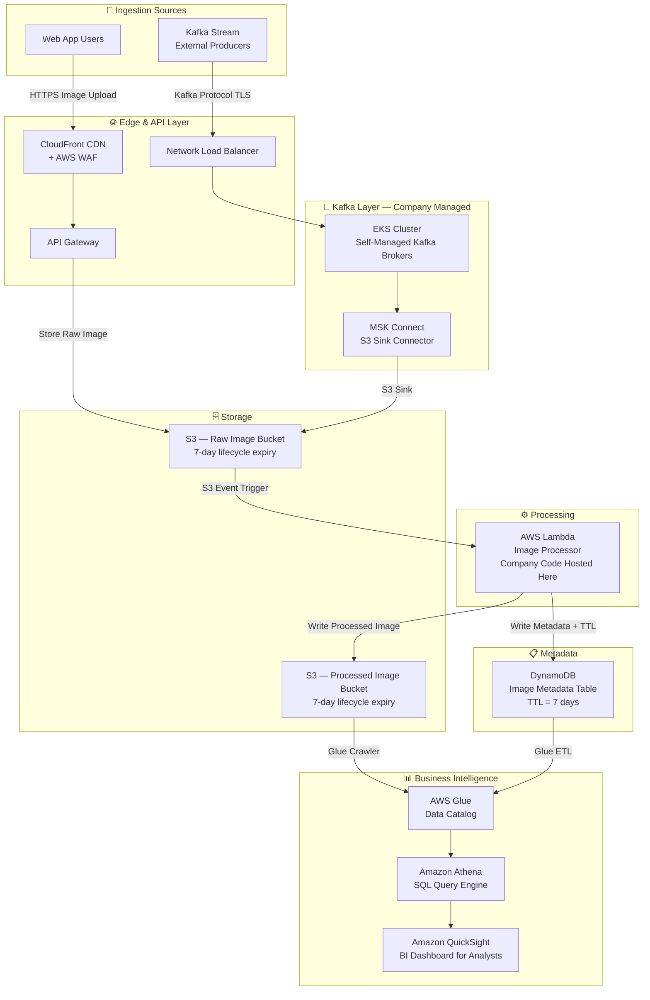
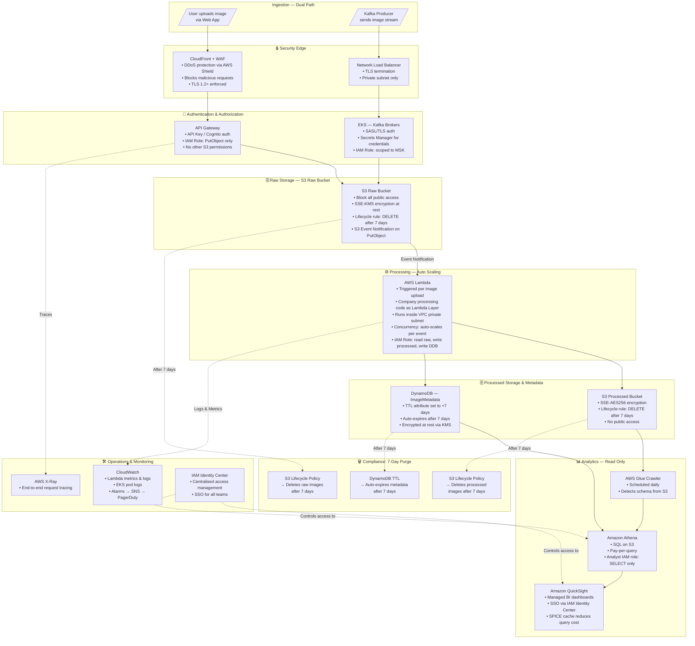

# Section 3 — Design 2: AWS Architecture Diagrams

---

## Diagram 1: High-Level Architecture (End-to-End Overview)

```mermaid
graph TB
    subgraph Users["👤 Ingestion Sources"]
        UA[Web App Users]
        KP[Kafka Stream<br/>External Producers]
    end

    subgraph Edge["🌐 Edge & API Layer"]
        CF[CloudFront CDN<br/>+ AWS WAF]
        APIGW[API Gateway]
        NLB[Network Load Balancer]
    end

    subgraph Kafka["📨 Kafka Layer — Company Managed"]
        EKS[EKS Cluster<br/>Self-Managed Kafka Brokers]
        MSKC[MSK Connect<br/>S3 Sink Connector]
    end

    subgraph Storage["🗄️ Storage"]
        S3R[S3 — Raw Image Bucket<br/>7-day lifecycle expiry]
        S3P[S3 — Processed Image Bucket<br/>7-day lifecycle expiry]
    end

    subgraph Processing["⚙️ Processing"]
        LAMBDA[AWS Lambda<br/>Image Processor<br/>Company Code Hosted Here]
    end

    subgraph Metadata["📋 Metadata"]
        DDB[DynamoDB<br/>Image Metadata Table<br/>TTL = 7 days]
    end

    subgraph Analytics["📊 Business Intelligence"]
        GLUE[AWS Glue<br/>Data Catalog]
        ATHENA[Amazon Athena<br/>SQL Query Engine]
        QS[Amazon QuickSight<br/>BI Dashboard for Analysts]
    end

    UA -->|HTTPS Image Upload| CF
    CF --> APIGW
    APIGW -->|Store Raw Image| S3R

    KP -->|Kafka Protocol TLS| NLB
    NLB --> EKS
    EKS --> MSKC
    MSKC -->|S3 Sink| S3R

    S3R -->|S3 Event Trigger| LAMBDA
    LAMBDA -->|Write Processed Image| S3P
    LAMBDA -->|Write Metadata + TTL| DDB

    S3P -->|Glue Crawler| GLUE
    DDB -->|Glue ETL| GLUE
    GLUE --> ATHENA
    ATHENA --> QS
```

---

## Diagram 2: Data Flow Detail — Security, Scaling & Lifecycle

```mermaid
flowchart TD
    subgraph Ingest["Ingestion — Dual Path"]
        direction TB
        A1[/"User uploads image\nvia Web App"/]
        A2[/"Kafka Producer\nsends image stream"/]
    end

    subgraph Security_Edge["🔒 Security Edge"]
        B1["CloudFront + WAF\n• DDoS protection via AWS Shield\n• Blocks malicious requests\n• TLS 1.2+ enforced"]
        B2["Network Load Balancer\n• TLS termination\n• Private subnet only"]
    end

    subgraph Auth["🔑 Authentication & Authorization"]
        C1["API Gateway\n• API Key / Cognito auth\n• IAM Role: PutObject only\n• No other S3 permissions"]
        C2["EKS — Kafka Brokers\n• SASL/TLS auth\n• Secrets Manager for credentials\n• IAM Role: scoped to MSK"]
    end

    subgraph RawStorage["🗄️ Raw Storage — S3 Raw Bucket"]
        D1["S3 Raw Bucket\n• Block all public access\n• SSE-KMS encryption at rest\n• Lifecycle rule: DELETE after 7 days\n• S3 Event Notification on PutObject"]
    end

    subgraph Proc["⚙️ Processing — Auto Scaling"]
        E1["AWS Lambda\n• Triggered per image upload\n• Company processing code as Lambda Layer\n• Runs inside VPC private subnet\n• Concurrency: auto-scales per event\n• IAM Role: read raw, write processed, write DDB"]
    end

    subgraph ProcessedStorage["🗄️ Processed Storage & Metadata"]
        F1["S3 Processed Bucket\n• SSE-AES256 encryption\n• Lifecycle rule: DELETE after 7 days\n• No public access"]
        F2["DynamoDB — ImageMetadata\n• TTL attribute set to +7 days\n• Auto-expires after 7 days\n• Encrypted at rest via KMS"]
    end

    subgraph BI["📊 Analytics — Read Only"]
        G1["AWS Glue Crawler\n• Scheduled daily\n• Detects schema from S3"]
        G2["Amazon Athena\n• SQL on S3\n• Pay-per-query\n• Analyst IAM role: SELECT only"]
        G3["Amazon QuickSight\n• Managed BI dashboards\n• SSO via IAM Identity Center\n• SPICE cache reduces query cost"]
    end

    subgraph Lifecycle["🗑️ Compliance: 7-Day Purge"]
        H1["S3 Lifecycle Policy\n→ Deletes raw images after 7 days"]
        H2["S3 Lifecycle Policy\n→ Deletes processed images after 7 days"]
        H3["DynamoDB TTL\n→ Auto-expires metadata after 7 days"]
    end

    subgraph Ops["🛠️ Operations & Monitoring"]
        I1["CloudWatch\n• Lambda metrics & logs\n• EKS pod logs\n• Alarms → SNS → PagerDuty"]
        I2["AWS X-Ray\n• End-to-end request tracing"]
        I3["IAM Identity Center\n• Centralised access management\n• SSO for all teams"]
    end

    A1 --> B1 --> C1 --> D1
    A2 --> B2 --> C2 --> D1

    D1 -->|Event Notification| E1
    E1 --> F1
    E1 --> F2

    F1 --> G1 --> G2 --> G3
    F2 --> G2

    F1 -.->|After 7 days| H2
    D1 -.->|After 7 days| H1
    F2 -.->|After 7 days| H3

    E1 -.->|Logs & Metrics| I1
    C1 -.->|Traces| I2
    I3 -.->|Controls access to| G3
    I3 -.->|Controls access to| G2
```
