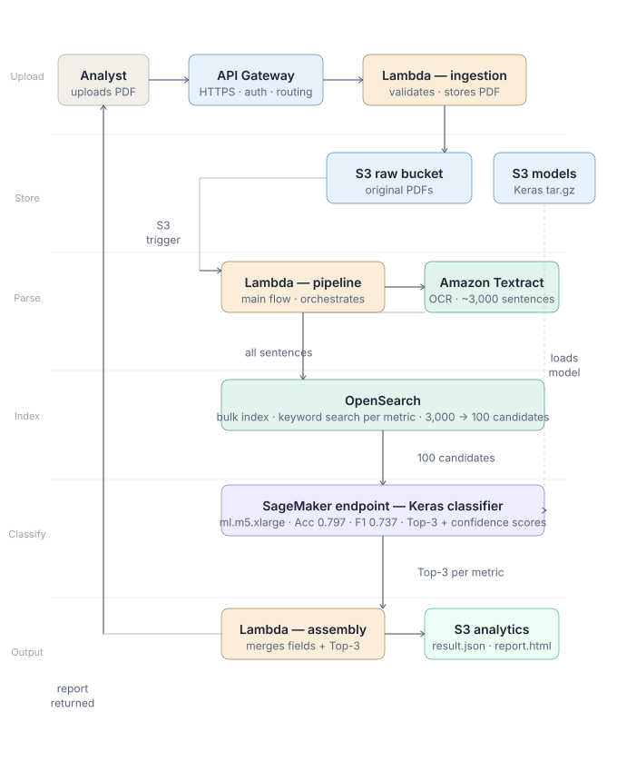

# Financial Report Analyzer — AWS Pipeline

End-to-end system ingesting annual and quarterly PDF reports and producing
structured financial analysis reports with supporting sentence evidence.

**Clients:** DBS · Credit Suisse · BCA  
**Model:** Keras text classifier · Accuracy 0.797 · Macro F1 0.737

---

## Architecture



**Two Lambda functions:**
- `ingestion` — receives PDF via API Gateway, writes to S3 raw bucket (lightweight, 30s timeout)
- `pipeline` — triggered by S3 ObjectCreated, runs the full flow (15min timeout)

**Full pipeline flow inside the pipeline Lambda:**
```
S3 trigger (PDF uploaded)
  → Amazon Textract     — extracts all text (~3,000 sentences)
  → OpenSearch          — bulk indexes sentences, keyword search per metric (3,000 → 100)
  → SageMaker endpoint  — Keras classifier, Top-3 + confidence scores per metric
  → Assembly            — merges results → result.json + report.html → S3 analytics
```

**Three S3 buckets:**
- `raw`       — original PDF files
- `models`    — Keras model tar.gz (loaded by SageMaker)
- `analytics` — report.html + result.json (analyst access)

---

## Directory structure

```
financial-report-analyzer/
│
├── ingestion/
│   └── lambda_handler.py        Lambda 1: API Gateway → S3 raw bucket
│
├── pipeline/
│   └── lambda_handler.py        Lambda 2: full pipeline
│                                  Textract → OpenSearch → SageMaker → report.html
│
├── stage2_classification/
│   ├── inference.py             SageMaker entry point (model_fn / predict_fn)
│   ├── model/
│   │   └── save_model.py        Save + package trained Keras model
│   ├── deploy/
│   │   └── upload_and_deploy.py Upload model to S3 + deploy SageMaker endpoint
│   └── test/
│       └── test_local.py        Local model test (no AWS needed)
│
├── docs/
│   └── architecture.svg         Architecture diagram
│
├── infra/
│   └── main.tf                  S3 buckets, IAM roles, API Gateway, 2× Lambda, S3 trigger
│
├── README.md
└── README.html
```

---

## Setup

### 1. Deploy SageMaker endpoint (do this first)

```bash
python stage2_classification/model/save_model.py
python stage2_classification/test/test_local.py
python stage2_classification/deploy/upload_and_deploy.py
```

### 2. Deploy infrastructure

```bash
zip -r infra/lambda_functions.zip ingestion/ parsing/ stage2_classification/ -x "*__pycache__*"

cd infra
terraform init
terraform apply \
  -var="opensearch_host=your-domain.ap-southeast-1.es.amazonaws.com"
```

### 3. Upload a report

```bash
curl -X POST \
  "https://your-api-id.execute-api.ap-southeast-1.amazonaws.com/prod/upload?company=amazon&year=2026&type=annual" \
  -H "Content-Type: application/pdf" \
  --data-binary @amazon_annual_report_2026.pdf
```

Output in S3 analytics bucket:
```
reports/amazon/2026/{file_id}_report.html
reports/amazon/2026/{file_id}_result.json
```

### 4. Clean up

```bash
aws sagemaker delete-endpoint --endpoint-name keras-financial-classifier
cd infra && terraform destroy -var="opensearch_host=your-domain..."
```

---

## Design decisions

| Decision | Why |
|---|---|
| Single pipeline Lambda (not Step Functions) | Report processing takes 2-3 min — one Lambda is sufficient; no orchestration overhead needed |
| OpenSearch for indexing + retrieval | All sentences indexed once at parse time; instant keyword search at query time |
| SageMaker CPU instance (ml.m5.xlarge) | Keras inference on 100-sentence batches is fast on CPU; no GPU cost |
| S3 raw / models / analytics separation | Different access controls and lifecycle policies per bucket type |
| result.json + report.html | JSON for programmatic access; HTML for direct analyst browser access |
